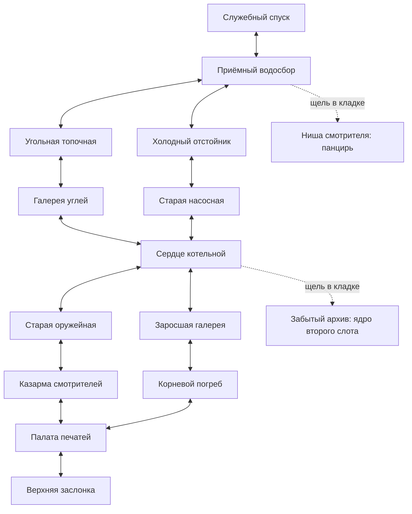

# Путь смотрителя

Отдельный авторский маршрут, поручение от 08.10.2026. Цель первого прохождения — около пяти минут с исследованием, без обязательных таймеров. В меню прежние уровни остаются отдельными пунктами.

Каждая линия графа — физический двунаправленный коридор. Можно пройти по обеим ветвям и вернуться по любой из них, в том числе во время незавершённого боя. Все пятнадцать помещений постоянно существуют в одном мире; прямой путь проходит девять основных. Два тайника необязательны.

| Комната | Встречи | Назначение |
|---|---|---|
| Служебный спуск | Нет | Безопасное начало, движение к видимой арке |
| Приёмный водосбор | Плевун → два Плевуна | Хлыст, поглощение, первый дальний навык; первая развилка |
| Угольная топочная | Три пары: панцирник/Плевун, два Плевуна, панцирник/Плевун | Чередовать подход, защиту и дальность |
| Холодный отстойник | Три пары: два Плевуна, панцирник/Плевун, Плевун/панцирник | Больше дальнего давления в первой встрече |
| Галерея углей | Панцирник/Плевун → два панцирника → панцирник/два Плевуна | Привычная пара сменяется тройкой с фланговым давлением |
| Старая насосная | Два Плевуна → два панцирника → два Плевуна/панцирник | Сначала дистанция, затем сближение |
| Сердце котельной | Росток/Плевун → панцирник/Росток | Боковое уклонение от шипов; вторая развилка |
| Старая оружейная | Два панцирника → Плевун/панцирник → Росток/панцирник | Ветка с ближним давлением |
| Заросшая галерея | Росток/Плевун → Росток/панцирник → Плевун/Росток | Ветка с линиями шипов |
| Казарма смотрителей | Панцирник/Росток → два панцирника → все три обычных типа | Разделить защитников и использовать широкий хлыст |
| Корневой погреб | Два Ростка → панцирник/Плевун → все три обычных типа | Чередование дальнего и ближнего давления |
| Палата печатей | Два Плевуна/панцирник → все три типа → два панцирника/Росток | Общая проверка перед финалом |
| Верхняя заслонка | Два Плевуна → Страж | Финал с тремя читаемыми видами подготовки Стража |

На прямом пути 45 противников, включая одного Стража. В одной группе не больше трёх; при отступлении близкие преследователи из соседней комнаты могут оставаться активными. Между группами — короткое предупреждение на полу (1,2 с), а не длительное ожидание. Характеристики врагов, урон, перезарядки и движение героя не изменены.

## Формы и ориентиры

Помещения соединены коридорами шириной 3,4 м с открытыми стыками. Водосбор имеет Т-образный план; топочная — Г-образный. В отстойнике чаша разделяет путь на два обхода. Галерея углей узкая и длинная, насосная — поперечный зал. В центральной котельной печь делит пространство и закрывает линию выстрела. Оружейная и казарма имеют разные расстановки массивного реквизита, заросшие помещения — корневые островки. Палата печатей раскрывает боковые подходы, а финальная заслонка расположена на верхней террасе с пандусом. Передние стенки низкие в изображении и физике; крыши нет.

## Состояние и управление

Один герой, боевой runtime и все комнаты живут в общей сцене. Границы не меняют положение, здоровье, перезарядки или экземпляры врагов. Зачищенные комнаты не заселяются заново, неизученные источники остаются на месте. Дальние враги за 24 м спят с сохранением состояния; близкие могут преследовать в коридоре. Следующая группа появляется, когда герой находится внутри её помещения. Смерть восстанавливает текущую встречу и входные навыки/слоты с полным здоровьем; другие встречи и их источники сохраняются. «Новый заход» сбрасывает всё. Дисковое сохранение не добавлено.

WASD — движение; мышь — прицел; ЛКМ — хлыст; ПКМ/Q — слоты; E удерживать у следа для поглощения, нажать у ядра/финального выхода; проходы не требуют E; Tab — выбор навыков после зачистки; Esc — пауза; пробел зарядить и отпустить — прыжок.

Выпадение героя за низкий борт наносит 10 урона и возвращает на входную площадку. Упавший враг возвращается на пол с тем же здоровьем, без выдачи убийства или навыка. Противников нельзя потерять под уровнем и тем самым заблокировать выход.

## Проверка темпа

Цель 240–360 секунд относится к первому человеческому прохождению. Боевой бот прошёл две ветки за 252.58/259.12 с, окончательный оконный проход — за 250.33 с без смертей. Использованы обычные движение, атаки и поглощение, один слот. Автоматическое прохождение отдельно фиксирует действия, фактические повреждения, смерти, время комнат и общее игровое время. Оно подтверждает проходимость конкретной стратегией, но не заменяет наблюдение за первым игроком. Результаты и ограничения связного уровня — [отчёт KEEPERS-SEAMLESS](../output/keepers_seamless_2026_10_08/VALIDATION_REPORT.md). Прежний `keepers_run_2026_10_08` относится к изолированным аренам.
