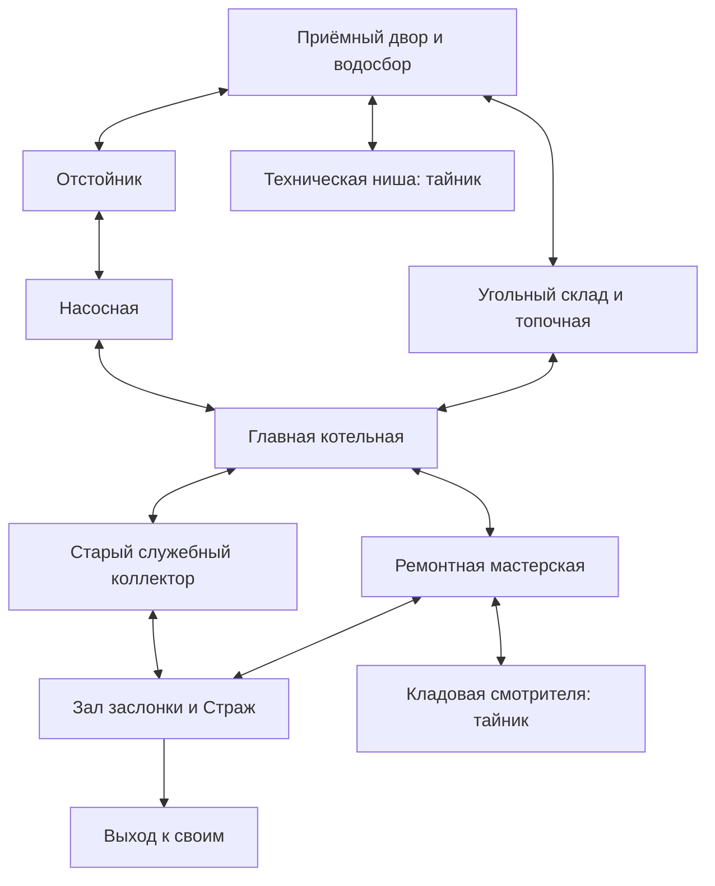

# Финализация «Пути смотрителя»

Дата: 08.10.2026. Статус: **APPROVED / IMPLEMENTATION_IN_PROGRESS**.

По последующему «Продолжай» выполнен проход F06: рабочие источники света, мягкий пар, ход противовеса, предупреждения и локальный звук со слушателем у героя. Переходы проверяются физическим движением в обе стороны при 720p/1080p; [отчёт F06](../output/keepers_f06_2026_10_08/VALIDATION_REPORT.md) отделяет технические результаты от приёмки. Следующий открытый пункт — F07: человеческое первое прохождение, визуальный и слуховой отзыв. Продолжение работы не считается подтверждением достигнутого качества референса. Ниже сохранена история пакетов и первоначальный план.

F04, второй проход: обновлены модели печи/котла, уголь/тележка, свод прохода, перевязка стен, трубы, материалы и порода. Эталон находится в игре и проходит техническую проверку; визуального одобрения пользователем ещё нет. [Текущий эталон и проверки](../output/keepers_art_f04_2026_10_08/VALIDATION_REPORT.md). По следующему поручению «Делай дальше» выполнен проход наполнения F05 всего корпуса; [новые модели, кадры и проверки](../output/keepers_f05_2026_10_08/VALIDATION_REPORT.md). Художественная приёмка и F06/F07 остаются открыты.

Пользователь разрешил реализацию сообщением «Приступай». Первая игровая итерация F01–F03 и художественный эскиз F04 доступны в `keepers_facility.tscn`; [фактическое состояние](KEEPERS_FACILITY.md) и [отчёт](../output/keepers_finalization_2026_10_08/VALIDATION_REPORT.md). Визуальная приёмка F04/F05 и общая доводка F06/F07 не закрыты. F05 разрешён прямым последующим поручением пользователя.

Основание — просьба пользователя подготовить план: интересная и правдоподобная планировка, стены и заполненное пространство за ними, ловушки и разнообразие, законченный арт уровня с ориентиром на Infamous Keepers. Этот документ не означает, что перечисленные изменения уже сделаны. При первоначальном составлении плана игровой код и сцены не менялись; дальнейшая реализация отдельно одобрена пользователем. Предложенные объединения комнат, новые опасности и художественный подход предстоит реализовать и проверить; текущие результаты бесшовной версии остаются историческим исходным замером.

## 1. Цель и главные решения

Сделать один компактный, бесшовный и законченный уровень, который воспринимается как **старый водотепловой узел под крепостью**. Слайм попал в нижнюю служебную часть и выбирается через верхнюю заслонку к своим. Назначение места объясняет планировку, материалы, оборудование, врагов, поломки и опасности. Это развитие нынешней котельной, а не смена исходной завязки.

Приоритеты: интересные решения игрока → читаемость и справедливость → связность и правдоподобие → художественная детализация. Инженерная схема нужна как опора для игры, а не как требование буквального моделирования заводского процесса.

Рекомендуемые решения:

1. Около **8 функциональных зон и 2 компактных тайников**, вместо обязательного сохранения 13 основных комнат. Количество уточнить после серого прохода; комнаты должны оправдывать свою игровую и хозяйственную роль.
2. Две разные петли: топливная/водная и рабочая/заброшенная. Сохраняется свободный возврат.
3. Полноценная архитектурная оболочка: стены с толщиной, согласованный срез для камеры, порода и конструктивная масса между помещениями.
4. Два семейства активных опасностей и один эпизод с повреждённым маршрутом. Они заменяют часть повторяющихся волн.
5. Один полностью законченный фрагмент с переходом в соседнее помещение задаёт качество всему уровню. Тиражировать его после визуального сравнения и игрового прохода.

Сохраняются Godot 4.x, существующий 3D-герой, ортографическая камера, WASD/прицел, хлыст, поглощение, прыжок, до двух слотов и три нынешних навыка. Цель — сопоставимые цельность, плотность и читаемость окружения; переход на пиксельный рендер или другой жанр не предполагается. Новые враги, способности, экономика и процедурная генерация для этого уровня не требуются.

## 2. От чего отталкиваемся

Проверено по текущему коду и реальным сохранённым кадрам:

- Связность уже работает: 15 помещений, 16 физических соединений, сохранение состояния и возвраты. Это основа, которую надо сохранить при перестройке.
- В `scripts/keepers/keepers_world_layout.gd` помещения расположены в повторяющихся рядах по обе стороны центральной оси. Суммарный диапазон пола по Z около 191 м; связи читаются как растянутый граф отдельных арен. Например, путь к небольшой нише `spring` содержит примерно 23.5 м отдельного коридора.
- В `scripts/keepers/keepers_world_geometry.gd` передние стены имеют высоту **0.34 м**, все стенки коридоров — **0.30 м**. Коллизии также низкие, а владелец cutaway пустой. Поэтому ощущение отсутствия стен объясняется геометрией, а не случайным сбоем скрытия.
- Внешней оболочки нет: за контурами виден фон `Environment`. Печь, вода, трубы и места персонала пока не объединены в читаемое хозяйство.
- На прямом пути 45 противников, почти везде несколько волн. Ранее бот проходил уровень за 250–259 игровых секунд. Это не человеческий замер; добавление ловушек поверх всех нынешних боёв увеличит длину и утомительность.
- Имеющиеся модели, ровная плитка и редкий реквизит дают технический прототип, а не финальный художественный образ. Предыдущие PASS подтверждают проходимость, но не художественное качество.

Источники исходного состояния: [текущий маршрут](KEEPERS_RUN.md), [проверки бесшовной версии](../output/keepers_seamless_2026_10_08/VALIDATION_REPORT.md), `combat_images/hub-cleared.png`, `furnace-1-wave2.png`, `images/room-cistern.png`, `room-entry.png` в той же папке результатов.

## 3. Как используем референсы

| Референс и проверенный материал | Что переносим в собственный уровень |
|---|---|
| [Infamous Keepers, Story Trailer, Goblinz Publishing](https://www.youtube.com/watch?v=1GuYNCrCU2k), страница от 06.10.2026. В этой задаче рассмотрены отдельные кадры около 0:35, 1:10, 1:30 и 1:35 | Кухня узнаётся по рабочему столу, посуде, запасам и очагу; проёмы имеют тяжёлое каменное обрамление; стены образуют тёмные объёмы; группы реквизита и локальный свет оставляют ясный пол для действия. Холодный зал использует другой материал/свет и свой главный объект. Это визуальные наблюдения, не сведения о внутреннем алгоритме рендера. |
| [Infamous Keepers — официальная страница](https://goblinzstudio.com/game/infamous-keepers/) | Используем художественный ориентир. Заявленный Tower Defense / Tactical Roguelite не переносим в боевую систему слайма. |
| [Diablo IV — разбор окружения Blizzard, март 2022](https://news.blizzard.com/en-us/article/23788294/diablo-iv-quarterly-updatemarch-2022) | Правдоподобие через конструкцию, материалы и историю места; тематические наборы реквизита; контролируемая детализация под фиксированную камеру; продолжение мира за игровым маршрутом. Не переносим масштаб производства или генерацию подземелий. |
| [Hades — официальные заметки Supergiant](https://www.supergiantgames.com/blog/6/) | В заметках отдельно исправляются геометрия небольших комнат, зоны попадания ловушек и читаемость эффектов; ловушки способны наносить урон врагам. Для нашего плана это ориентир на согласование пространства, опасностей и боя. Кривая темпа ниже — наше предложение, не измерение Hades. |

По ролику нельзя надёжно установить, как именно Infamous Keepers скрывает стены. Проверять будем визуальный результат: читаемая кладка, закрытые границы, целые примыкания и хороший обзор действий. Оригинальные модели/текстуры этих игр не используются.

## 4. Планировка: единое сооружение

Сначала составить два слоя одного плана: **как место работало** и **как его проходит игрок**. Для каждого прохода ответить: кто здесь ходил, что переносил, почему проход такой ширины, куда ведёт и почему сохранился или разрушился. Дверь должна вести в логичное соседнее помещение; трубы, водостоки и топливный путь должны иметь начало и продолжение.

Это схема связей, **не готовый геометрический план**. В F01 нужна размерная укладка помещений с общей кладкой, конструктивной сеткой и проверенными высотами. Две ветки не должны повторять друг друга зеркально.

| Зона | Что объединяем / сохраняем | Смысл, форма и наполнение | Основное действие |
|---|---|---|---|
| Приёмный двор и водосбор | `entry + junction` | Служебный вход, следы доставки, водоприёмная решётка, подъёмное устройство, складская ниша; от входа виден ориентир котельной | Ориентация, короткий первый бой, поглощение; безопасное знакомство с опасностью |
| Угольный склад и топочная | `furnace + cinder_gallery` | Сухое хранилище рядом с топкой, угольные отсеки, тележка/желоб подачи, кочерги, зольник, дымоход; изгиб обхода объяснён оборудованием | Более короткая, горячая ветка; выбор момента прохода и позиции для боя |
| Отстойник | `cistern` | Реальный приток и слив, осадок, решётки, влажная кладка, обслуживающий настил с двух сторон | Пространственный выбор и дальний противник; безопасный обход повреждения |
| Насосная | `pump_room` | Насосы связаны трубами с водой и котлом, есть площадка обслуживания и привод; поперечное помещение | Знакомство с движущимся механизмом, затем короткая комбинация с врагом |
| Главная котельная | `hub` | Крупный котёл, топливный и водный вводы, манометр, пароотвод, рабочая площадка; главный ориентир уровня | Бой с обходом крупного укрытия и уже знакомой опасностью |
| Ремонтная мастерская | `armory + barracks` | Верстак, тиски, запасные детали, снятые панели, полки, шкаф дежурного и маленькая бытовая ниша | Передышка/осмотр, выбор навыков при безопасности, открытие служебного сокращения |
| Старый служебный коллектор | `garden + root_cellar` | Трубный обход с настоящей причиной зарастания: трещина, утечка и свет; корни следуют этому источнику | Альтернативный маршрут, необязательный прыжок/секрет, другое направление подхода |
| Зал заслонки | `gauntlet + summit` | Направляющие затвора, привод, противовесы, пост управления; верхняя площадка и источник наружного света | Передышка перед Стражем, финальное сочетание знакомых требований, выход |

Тайник у входа — примыкающая ниша обслуживания со следом слаймов и ранним панцирем. Второй — кладовая/архив дежурного у мастерской, с прежним ядром второго слота. Подсказки: следы, щель, потерянная панель, сквозняк или локальный свет. Оба тайника имеют читаемый возврат и не требуют нового ключа/экономики.

Изменять размеры по фактическому контроллеру и боям. Не сужать коридор ради реализма до застревания слайма и врагов; не оставлять длинный пустой обход только ради пяти минут. Точные дистанции фиксируются после серого прохода.

## 5. Стены и пространство за ними

**Целевой образ — помещения, вырезанные внутри массива, с понятным архитектурным срезом.**

- Создать непрерывные стены: толщина, цоколь, внутренние/наружные углы, Т-примыкания, арки и дверные откосы. Соседние комнаты используют общую границу; между ними не виден фон.
- Задние и боковые стены дают полную высоту и опору композиции. Для переднего плана разработать устойчивый авторский срез с тёмной верхней гранью и читаемой толщиной. Не превращать всю переднюю часть обратно в одинаковый низкий забор.
- На эталоне сравнить постоянный архитектурный срез с ограниченным раскрытием **целой заранее заданной верхней секции** там, где без него теряется герой/атака. Предпочесть вариант с меньшим числом изменений в движении. Не возвращать круглую маску вокруг героя или исчезновение отдельных камней.
- Верх визуальной стены и физическая закрытая граница — отдельные вещи. Закрытая кладка продолжает блокировать движение и урон; её срез ясно выглядит сплошным массивом. Настоящие низкие ограждения и места прыжка должны выглядеть иначе. Проверить риск «видимый проход, но невидимая стена».
- Пол, телеграфы атак, опора под ногами и точка приземления остаются видимыми. При скрытии верхней секции её декор и тени меняются согласованно; физический выстрел не проходит через камень.
- За наружными стенами построить крупные массы скалы/кладки, недоступные технические объёмы, каналы, шахты и фрагменты соседнего оборудования. Деталь плотнее возле доступного пути, спокойнее в глубине. В зоне камеры нет случайных чёрных щелей; темнота остаётся внутри обоснованных глубоких отверстий и дальнего окружения.
- Проверить нынешнее скрытие целых комнат на 44 м: новый внешний массив не должен появляться и исчезать островками. Настройку дальности/групп видимости выбрать по новой оболочке и замеру, а не переносить старое число автоматически.

Первый контрольный фрагмент обязательно включает **комнату, коридор, угол, дверной проём и кусок соседнего помещения**: одиночный красивый зал не проверяет стыки.

## 6. Ловушки, действия и темп

Новый игрок ещё осваивает прицел, хлыст и поглощение; опытному игроку быстро наскучит одинаковое устранение волн. Сейчас основная нагрузка приходится на механику боя, а чтение пространства и выбор пути почти не развиваются. Поэтому каждый следующий участок должен менять вопрос, на который отвечает игрок.

### Ограниченный набор опасностей

| Семейство | Объяснение в мире | Предупреждение и решение игрока | Ограничение |
|---|---|---|---|
| Прорыв пара | Повреждённый клапан/труба у топки и котла | Шипение, рост давления и видимый след струи; переждать в кармане, пройти между выбросами либо обойти. Затем использовать струю против врага | Вводится без врагов; источник и зона урона совпадают с изображением. Пар не закрывает весь обзор |
| Привод и противовес | Механизм насоса/заслонки | Видимое движение и звук цикла; оценить безопасное окно или выбрать обход. Рычаг открывает полезное служебное сокращение | Без мгновенной смерти и без блокировки единственного обратного пути; одинаково понятные правила для врагов |
| Повреждённый обслуживающий настил | Разрушение от воды/корней | Трещины, сорванные крепления, видна нижняя опора и лестница/пандус возврата; короткий рискованный путь либо спокойный обход | Необязательный прыжок использует нынешний контроллер. Без одноразового обрушения, способного оборвать возврат, в первой реализации |

Это два вида активных ловушек и один пространственный эпизод, а не три новые подсистемы. Не добавлять ради количества яд, лазеры, огненные лужи, скрытые шипы и случайные провалы. Для каждого семейства: отдельная сцена с собственным состоянием, единый такт предупреждения/активации/отдыха, ограниченный урон, пауза, повтор, правило воздействия на команды. Числа урона и времён — после испытания первого экземпляра, с записью в BALANCE_CHANGELOG.

Каждую угрозу сначала показать с безопасной точки наблюдения, затем дать применить, потом соединить с боем. Не наносить первый удар из-за края камеры или в месте появления героя. В финале использовать максимум одну уже знакомую опасность одновременно с сигналами Стража. Выключенные механизмы и найденные сокращения сохраняются при обычном возврате; при смерти не откатываются уже завершённые действия других зон. Контракт конкретного механизма записать и проверить до расстановки копий.

### Кривая прохождения — проектная гипотеза

| Отрезок прямого пути | Что делает игрок | Развиваемый навык | Риск и действие |
|---|---|---|---|
| 0:00–0:30 | Читает вход, ориентир выхода, ведёт короткий бой | Движение/хлыст/поглощение | Перегрузка новичка: не вводить ловушку во время первого поглощения |
| 0:30–1:30 | Выбирает горячую или водную ветку, видит цикл первой опасности | Наблюдение и решение о маршруте | Скука ожидания: безопасный обход и короткие циклы |
| 1:30–2:25 | Сражается у котла, использует укрытие/знакомую опасность | Позиционирование и сочетание навыков | Плато повторных волн: убрать лишние повторения, не повышать HP |
| 2:25–3:15 | Проходит мастерскую или коллектор, находит сокращение/намёк на тайник | Исследование и пространственная память | Потеря цели: видимый ориентир и понятный возврат |
| 3:15–3:35 | Видит зал заслонки и готовится | Планирование, безопасный выбор навыков | Передышка не должна превращаться в пустой длинный коридор |
| 3:35–4:45 | Побеждает Стража в знакомой геометрии | Применение освоенного | Резкий скачок: знакомая опасность, никаких новых обязательных правил |
| 4:45–5:00 | Открывает выход и видит результат | Завершение | Дать ясный визуальный и звуковой конец |

Все перемещения входят в эти отрезки; это **не результаты теста и не таймеры ожидания**. Ориентир прямого первого прохождения — 4–6 минут; исследование обеих петель и тайников может занимать дольше. Начальная гипотеза — 5–7 содержательных встреч вместо нынешних повторяющихся групп; количество врагов подобрать по новой геометрии и людям, число 45 не сохранять как требование.

## 7. Арт и наполнение

Для каждой зоны оформить короткий паспорт: прежняя функция → кто пользовался → как доставлялись материалы → что сломалось → главный объект → рабочий реквизит → следы эксплуатации → игровая роль. По кадру без названия должно быть понятно, зачем существовала комната.

Производство идёт в три масштаба:

1. **Крупные формы:** корпус здания, порода, котёл/насос/затвор, высоты и силуэты. Читаются при рабочей камере.
2. **Рабочие группы:** связные трубы с креплениями, место обслуживания, хранение, тележки, верстаки, инструменты. Рядом с каждым механизмом есть доступ для работника; шкафы и ящики не мешают открывать двери.
3. **Мелкие следы жизни:** копоть над топкой, зола у уборки, потёртости в проходах, влажность у утечек, осадок у воды, ремонтные заплаты. Причина определяет место, а не равномерный шум по всему уровню.

Нужны законченные модульные модели, аккуратные пропорции, UV/материалы, фаски и силуэтные детали; одних дополнительных примитивов недостаточно. Сначала проверить выбранный способ производства на эталоне. Собственные материалы/модели и совместимые разрешённые пакеты допустимы; внешние и генеративные ресурсы проходят проверку происхождения/условий и ASSET_MANIFEST. Концепт-картинка не считается готовым игровым ассетом.

Минимальные наборы для производства:

- Архитектура: стены/углы/Т-стыки, арки, двери и откосы, цоколи/карнизы/срезы, контрфорсы, настилы, пандусы, 2–3 согласованных варианта пола.
- Внешний массив: крупная порода, кладка, технические шахты, закрытые соседние объёмы, водные каналы и опоры.
- Главные объекты: топка с топливным вводом, котёл, насос с приводом, узел заслонки, рабочий верстак. У каждого — назначение, связные коммуникации и характерные следы использования.
- Реквизит по функциям: топливо/уборка, вода/ремонт, смена персонала. Расставлять композиционными группами; середину боя оставлять читаемой, мелкий мусор не превращать в цепляющие коллизии.
- Материалы и палитры: общий камень и железо связывают весь корпус; горячая зона — копоть и янтарный свет, водная — влажность и холодный отражённый свет, заброшенная — выцветшие поверхности и рост корней. Одинаковые материалы имеют одинаковый масштаб.
- Свет/FX/звук: обоснованные источники, локальная подсветка маршрута, механические шумы по зонам, капли, гул, шипение, пыль и пар. Приоритет сигналов урона выше атмосферы; эффекты не маскируют площадку приземления и врагов.

Уровень готов по арту, когда не осталось случайных временных главных объектов, зоны имеют собственное назначение и настроение, кадр цельный и действие читается. Количество предметов и полигоны сами по себе не являются критерием качества.

## 8. Пакеты работ и критерии перехода

| Пакет | Работа и результат | Критерий готовности / зависимость |
|---|---|---|
| **F01. План здания и сценарий** | Размерный план, связи хозяйства и игрока, 8 паспортов зон, две разные петли, два тайника, кривая темпа и места ловушек | У каждой комнаты/двери/связи есть объяснение; нет коридоров только ради длины; виден путь к финалу. Первый пакет реализации |
| **F02. Серый уровень и оболочка** | Пересобрать помещения, полную физику стен/проёмов, массу за ними, рабочий срез; сохранить состояние и возвраты | Весь граф пройден в обе стороны; нет пустот/невидимых препятствий, прыжки и камера читаются. Сначала без затратного декора |
| **F03. Разнообразие прохождения** | Два вида ловушек, один эпизод настила, служебное сокращение, секреты и перераспределённые встречи | Можно понять опасности без объяснения автора; нет мягких блокировок, бессмысленного ожидания и урона из-за камеры. Проверить людям серый маршрут |
| **F04. Эталон качества** | Полностью закончить топочную + угол коридора + часть соседнего узла: модели, материалы, стена/порода, реквизит, свет, одна ловушка, бой и звук | Сравнить игровые кадры с выбранными референсами на той же крупности, получить визуальный отзыв, исправить замечания; замерить бой в 720p/1080p. До этого не тиражировать весь арт |
| **F05. Полное наполнение** | Разнести проверенный модульный набор по корпусу; создать разные главные объекты и функциональные группы, оформить тайники | Все зоны узнаваемы без названий, коммуникации связны, нет одинаковых пустых арен и прототипных главных объектов |
| **F06. Общая доводка** | Согласовать свет/материалы/звук, эффекты и сигналы; убрать лишние предметы, шум, пересечения, неверный масштаб, резкие границы | Маршрут читается в движении и бою; внешний массив не появляется рывками; эффекты не перебивают угрозы |
| **F07. Приёмка уровня** | Прохождение новых игроков, возвраты/тайники, смерть/пауза/повтор, враги у стен/ловушек, нативные замеры и экспортный запуск | Закрыты блокирующие дефекты; достигнуты функциональные, игровые и визуальные критерии ниже. Зафиксировать отзыв и оставшиеся ограничения |

Зависимости: F01 → F02 → F03 → F04 → F05 → F06 → F07. Эскизы/подбор материалов можно вести параллельно серой планировке; изготовление всего набора до проверки эталона создаёт риск переделок. Календарную оценку дать после F04: объём финальных моделей, способ их производства и число художественных итераций пока не установлены.

## 9. Приёмка

**Архитектура и обзор:** у каждого помещения и прохода есть понятная функция; все границы в контрольных ракурсах имеют кладку/породу/обоснованную глубину, случайных чёрных разрывов нет. Проверяются вход, центр, оба края, коридор, углы, перепады, возврат и бой у передней стены. Полы, опора, враги и важные телеграфы не пропадают вместе со стеной. Срез не выглядит как проходимый бортик.

**Игра:** две ветки различаются решением, а не только цветом. Новая угроза сначала представлена отдельно. Есть бой, чтение опасности, пространственный выбор, осмотр и короткая передышка. Все пути и тайники доступны обратно; механизм/смерть/повтор не перекрывают единственный маршрут. Поглощение, смена навыков и E у механизма не конфликтуют. Враги не застревают в новой мебели и не игнорируют закрытые стены.

**Первый человек:** минимум три наблюдаемых прохождения без подсказок автора — пользователь и по возможности ещё два игрока. Записать время, ошибки навигации, повторные попадания под непонятную ловушку, застревания, пропущенные ориентиры и оценку повторяемости. Цель прямого пути — примерно 4–6 минут; если большинство быстрее или медленнее, менять лишние бои/расстояния, а не вводить искусственные задержки. Это предлагаемый критерий, пока NOT_RUN.

**Качество картинки:** эталон и весь маршрут оцениваются по настоящей игровой камере в движении. Назначение комнаты узнаётся без HUD; большой объект, рабочая группа и следы эксплуатации складываются в одну историю. Герой и сигналы урона заметны на фоне любого материала. Никаких технических заглушек среди главных объектов; происхождение принятых ассетов записано.

**Техника:** импорт и применимые существующие проверки; новые сценарии ловушек/состояния; физическое прохождение каждой связи туда-обратно; загрузка/смерть/пауза/перезапуск без утечек и блокировки. Нативный замер 720p/1080p в бою, с паром, несколькими врагами, в наиболее насыщенном кадре и при переходе. Предварительная цель на нынешней машине — p95 ≤16.7 мс, без заметных скачков от подгрузки/скрытия; пересмотреть бюджет на F04. Прежние 1.9–3.3 мс прототипа не считаются доказательством скорости финального арта. Экспортный запуск и звук проверить отдельно.

## 10. Границы этого плана

Главные риски — арт не достигнет цели при прежних примитивных моделях; полные стены ухудшат обзор; насыщение декором сломает физику/AI; новые ловушки растянут прохождение. Поэтому сначала функция и серый маршрут, затем один эталон в игре, затем тиражирование и приёмка.

При подготовке плана изучены код, актуальные документы, прежние реальные изображения, указанные первичные источники и фрагменты трейлера. Выполнен анализ темпа по `game-design-flow-audit`; выводы о скуке/сложности — гипотезы до человеческого теста. Движок на диске — `output/S0/runtime/godot.exe`, версия файла 4.7.2.stable.steam; renderer в конфигурации — Compatibility. **Новых запусков Godot, тестов геймплея, производства/импорта арта и изменений уровня в этой задаче нет.**
