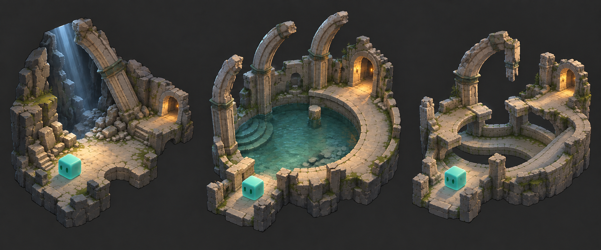
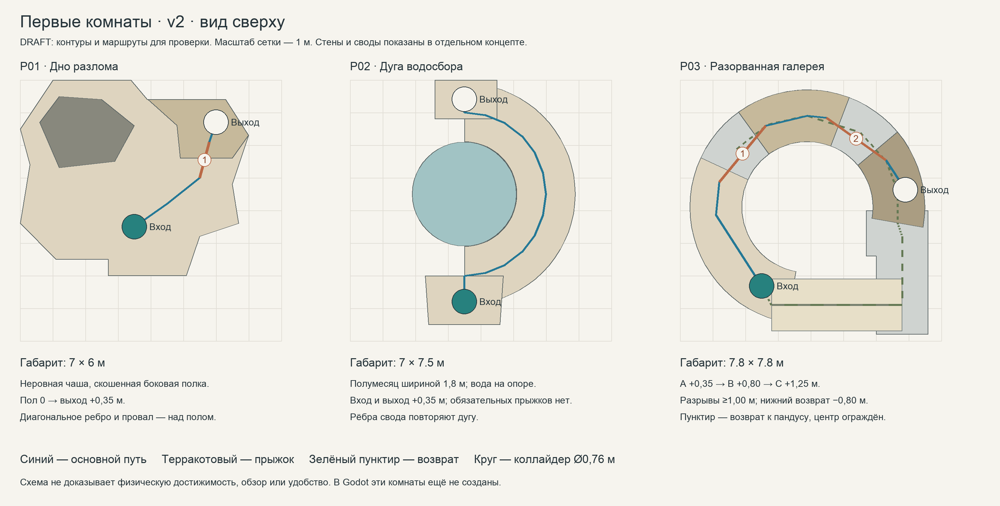

# Первые комнаты: путь после падения · v2

06.10.2026. **Реализован пробный маршрут; пользовательская оценка ещё не получена.** Пользователь отклонил первый эскиз как скучный и уточнил: «Форму и образ: меньше прямоугольных залов, выразительнее пространство».

## Уточнение реализации и масштаба

После поручения «делай тогда в игре» создан `scenes/opening/opening_route.tscn`. Позднее пользователь выбрал увеличение пространства для движения в полтора раза. Фактические габариты — 10,5×9 м, 10,5×11,25 м и 11,7×11,7 м. X/Z исходных координат расширяются в 1,5 раза при пересборке физических мешей и коллайдеров; размеры героя, скорость и Y сохраняются. Канонические runtime-данные — [resources/opening/layout.json](../resources/opening/layout.json); схемы и размеры ниже относятся к компактному эскизу.

В галерее внешняя/внутренняя ширина пути увеличена, угловые промежутки между настилами уменьшены до 19,22°: минимальный физический зазор остался около 1 м. Основание верхнего свода перенесено за место приземления. Возвратный пандус имеет 4,5 м наклонного участка и 1,5 м площадки, ширину 2,4 м и уклон 14,34°. В настиле A вырезан открытый посадочный паз: прежнее наложение плиты создавало непроходимую ступень. Это изменения окружения под существующий контроллер.

Проход проверяется физически, камера фиксирована на центре комнаты; стены и верхние настилы скрывают только свои меши, сохраняя коллизии. Переходы — E у арок, финал — продолжение пути к своим, повтор или меню. Прежние концепты не подтверждают внешний вид реализации. Фактические проверки/кадры — [отчёт](../output/opening_rooms_2026_10_06/VALIDATION_REPORT.md).

Генеративный концепт показывает характер архитектуры, свет и силуэты. Он не является скриншотом игры, точной моделью высот или новым обликом принятого героя v5. Для размеров служат [план сверху](../planning/opening-rooms/plan-v2.png) и [layout.json](../planning/opening-rooms/layout.json); это исторические кандидаты на геометрию; текущие размеры/края задают runtime-данные выше. Концепт не включён в runtime; условия использования REVIEW_REQUIRED.

## Что меняется

В v1 все три комнаты имели прямоугольный внешний контур; различие создавали предметы внутри. В v2 меняется само пространство: разлом со скошенными краями, водосбор с дуговым обходом, разорванное кольцо галереи. Пустоты, крупные опоры и высота работают вместе с полом. Прямоугольный габарит в JSON — только ограничивающая рамка, а не сплошная плита комнаты.

| Критерий | v1 | v2 |
| --- | --- | --- |
| Контур | Три коробки | Неровная чаша / полумесяц / разорванная C-образная галерея |
| Крупный образ | Осыпь, чаша, три блока | Каменная расселина с упавшим ребром / дуга свода / шахта с обходной галереей |
| Причина формы | Предметы расположены в зале | Обвал изменил помещение / обход следует водосбору / настил окружает шахту |
| Пространственный ритм | Похожие ровные площадки | Диагональ → дуга → движение вокруг пустоты и вверх |
| Цена | Простая сборка | Дополнительные угловые/дуговые части и проверка заслонок |

**Confirmed:** пользователь просит изменить форму; в старом координатном плане внешние полы прямоугольные. **Assumed:** три разных силуэта усилят ощущение места и запоминаемость. **Unknown:** нравится ли новый образ пользователю, насколько хорошо он читается в движении и в реальной камере. Красивый концепт не подтверждает интерес к прохождению.

## Сюжет и последовательность

Основание — [SOURCE_CONCEPT.md](SOURCE_CONCEPT.md): слайм потерял стаю, упал и ищет путь наверх к своим. Рабочая постановка начинает игру после падения. Черновая фраза «Мне надо наверх. К своим.» остаётся предложением. [Карта пути героя](../planning/hero-journey/CONTENT_NOTES.md) не превращает экзамен, Голос или Смотрителя в принятый канон.

| Комната | Пространственное событие | Действие | Сюжетный результат |
| --- | --- | --- | --- |
| P01 · Дно разлома | Старый зал разорван падением | Обогнуть осыпь и взять низкую полку | Найден боковой путь вместо высокого провала |
| P02 · Дуга водосбора | Архитектура огибает чашу | Пройти по сухой дуге | Обнаружен ход дальше в старое сооружение |
| P03 · Разорванная галерея | Настил вокруг шахты сохранился частями | Два коротких прыжка с нижним возвратом | Герой самостоятельно вернул часть высоты |

Намерение: растерянность → любопытство → осторожная уверенность. Монстров, наград и боевых ворот пока нет. Существующий бой, хлыст, заряжаемый прыжок и способности сохраняются; новая механика ради выразительности не требуется. Новые ID `opening-01`…`opening-03` не восстанавливают удалённые уровни.

Координаты обычные X/Y/Z, Y вверх; метры. Все размеры — кандидаты на физическую проверку с актуальным изометрическим контроллером. Стены, своды и внешний декоративный камень не прибавляются к проходимой площади молча.

## P01 · Дно разлома — габарит 7 × 6 м

**Образ:** неравномерная каменная чаша. Природная расселина прорезала остатки кладки. Одно крупное упавшее ребро свода стоит по диагонали и связывает высокий провал с осыпью. Осыпь собрана в одной стороне, а не рассыпана мелкими камнями по маршруту. Передний край срезан, задняя скала держит силуэт.

**Первый кадр:** герой на целой площадке, холодный свет приходит из недостижимой расселины; низкий боковой проход виден справа. Не подсвечивать провал как второй игровой выход. Образ падения создают сломанная кладка, направление ребра и свет, без обязательной кат-сцены или новой системы обвала.

| Элемент | Кандидат |
| --- | --- |
| Пол | Неровный 15-вершинный контур из JSON, Y=0; без прямоугольной подложки |
| Старт | (3,5; 0; 4,5); открытая площадка перед осыпью |
| Осыпь | Полигон слева; высота до 0,9 м; не разрушаемая |
| Полка | Скошенный шестигранный участок справа, Y=0,35 |
| Проход | Точка ожидания (6; 0,35; 1,3), ширина проёма 1,8 м |
| Крупный ориентир | Ребро/провал выше маршрута; нижняя часть ребра не пересекает посадку |

**Путь:** старт → диагональный проход между осыпью и скошенным краем → короткий прыжок на полку → боковой выход. Ошибка возвращает на целый нижний пол. Здесь нет ямы смерти, разрушения камней или точного разбега.

**Камера:** центр-кандидат (3,5; 0,35; 3), текущий фиксированный ракурс. В кадре остаются герой, место падения и боковой ход; не отдалять камеру ради декоративной верхушки скалы. Передняя скала и ребро делятся на самостоятельные визуальные заслонки с сохранением физических стен.

**Проверка:** путь и полка различимы в масштабе игры; диагональное ребро не заслоняет героя/посадку; игрок понимает, что наверх прямо не вернуться. Удобство и понимание NOT_RUN.

## P02 · Дуга водосбора — габарит 7 × 7,5 м

**Образ:** сухой полумесяц обходит круглую чашу. Три крупных сломанных ребра свода повторяют дугу и показывают назначение сооружения. Проёмы расположены на разных концах дуги. Помещение не оборачивается прямыми внешними стенами ради удобства модульной сборки.

**Первый кадр:** вход на ближнем конце, чаша внутри изгиба, тёплая арка на дальнем конце; вся сухая дуга видна. Тёплый свет обозначает следующий ход подземелья, а не поверхность или близость стаи.

| Элемент | Кандидат |
| --- | --- |
| Дуга | Центр X/Z=(3,5; 3,5); внешняя R=3,4, внутренняя R=1,6 м; ширина 1,8 м |
| Пол | Y=0,35 во всей комнате; отдельные входная/выходная площадки |
| Вход / выход | (3,5; 0,35; 6,8) → (3,5; 0,35; 0,6), проёмы 1,8 м |
| Чаша | R=1,6 м, твёрдая опора на той же физической высоте; вода — неглубокий визуальный слой |
| Бортик | Высота около 0,25 м, разрыв доступа шириной 1,2 м со стороны сухой дуги |
| Свод | Три крупных дуговых фрагмента и контрфорсы снаружи пути; передняя часть открыта |

**Путь:** вход → спокойный поворот по дуге → арка. Обязательного прыжка нет. В чашу можно зайти через разрыв бортика и выйти тем же путём; плавание, урон водой и задача со сливом не вводятся. Визуальная впадина не создаёт физическую ловушку.

**Камера:** центр-кандидат (3,5; 0,7; 3,75). Бортик, дуга и силуэт арки читаются одновременно. У ребра отдельные основания/верх, поэтому скрытие верхней части не стирает архитектуру целиком. Не закрывать героя колонной на середине обхода.

**Проверка:** поворот свободен с реальным радиусом героя, виден выход, чаша не похожа на обязательный опасный прыжок. Дуга и её рёбра требуют оконной проверки заслонок; NOT_RUN.

## P03 · Разорванная галерея — габарит 7,8 × 7,8 м

**Образ:** С-образная каменная галерея окружает открытую шахту. Настил разорван в двух местах; его крупные опоры и один сломанный свод показывают структуру по высоте. Это небольшой обход вокруг пустоты, не многоэтажная башня. От нижнего пола до выхода 2,05 м; от входа до выхода всего 0,9 м.

**Первый кадр:** вход на ближнем левом сегменте, два разрыва в дальней дуге, выход справа чуть выше. Нижний обход виден под обоими разрывами. Центральная шахта ограждена и не лежит под обязательной посадкой. Вид через пустоту показывает нижние опоры сооружения; не обещает переход в ранее посещённую комнату без отдельного проектирования связи.

| Элемент | Кандидат |
| --- | --- |
| Галерея | Центр X/Z=(3,9; 3,9), внутренняя R=2, внешняя R=3,6 м; ширина 1,6 м |
| A · вход | Углы 100…205°, Y=0,35 |
| B · передышка | 234…291°, Y=0,8 |
| C · выход | 320…370°, Y=1,25; точка ожидания около (6,90; 1,25; 3,37) |
| Разрывы | По 29°: минимум между краями ≈1,002 м, на средней линии ≈1,402 м; каждый подъём 0,45 м |
| Нижний возврат | Непрерывная C-образная опора Y=−0,80 под всей дугой и обеими щелями; дополнительный хвост справа |
| Пандус | (6,8; −0,80; 6,9) → (2,8; 0,35; 6,9); ширина 1,6, длина 4 м, уклон ≈16,04° |
| Шахта | Радиус 2 м; внутреннее ограждение нижнего пути около 1 м, отдельная физическая граница |

Полы задаются дуговыми полигонами, не тремя прямоугольными блоками на общей квадратной плите. Разрывы шире диаметра коллайдера 0,76 м минимум на 0,24 м, но это только геометрическая сверка. Их достижимость и запас управления ещё не проверены физически.

**Путь:** A → прыжок B → короткая остановка/поворот → прыжок C → выход. Оба прыжка проектируются под обычный импульс; полный заряд не является воротами. Если игрок сократит маршрут заряженным прыжком, это допустимо для этого черновика.

**Ошибка:** видимое приземление на нижнюю дугу → обход под галереей вправо → передний пандус → A. Центральное отверстие не используется как наказание; нижнее ограждение должно остановить выход внутрь. Полки/опоры не перекрывают нижний обход, Толщина настила — кандидат 0,15 м; под A остаётся 1 м, то есть высота героя 0,8 м плюс запас 0,2 м. Под B/C просвет больше. Это требование к будущей проверке, не уже существующий результат.

**Камера:** центр-кандидат (3,9; 0,8; 3,9). Все посадки и нижний возврат остаются видимыми. Скрываются части свода/передние ограждения; нижний пол и посадочные границы сохраняются. Реакцию камеры по Y при падении сравнить отдельно, не увеличивать общий zoom из-за свода.

**Проверка:** оба разрыва проходимы с запасом, различимы глубина и перепады; с нижнего пути можно вернуться; опоры не создают тупики; верхняя полка не выглядит финалом игры. Физика, камера и ощущение подъёма NOT_RUN.

## Общие ограничения и следующий образец

Сохраняются [правила изометрии](ISOMETRIC_DEVELOPMENT_RULES.md), обычная 3D-физика, текущий герой и управление: WASD, курсор, ЛКМ, заряд/отпускание пробела, колесо, Esc. Переходы — открытые проходы с E на широкой площадке, как предложение; новые сохранения и обратные межкомнатные маршруты не вводятся. Размер камеры остаётся кандидатом под реальный кадр, а не фиксируется картинкой.

Один набор камня, небольшие металлические обвязки и локальные световые акценты связывают комнаты. Рёбра свода имеют общий профиль: целое/разорванное/упавшее состояние. Сборка потребует нескольких угловых и дуговых частей вместо одних прямых стен; при этом не нужны новые навыки, ловушки, боссы, лут или случайная генерация. Не полировать мелкий декор до проверки масштаба и заслонок.

Минимальный следующий образец — **P01 в реальной камере**, с полом, двумя крупными силуэтами и полкой. Сначала сравнить обзор с центром комнаты/следованием, затем проверить прыжок. Решение о продолжении: пользователь принимает форму/масштаб, герой и выход читаются во всех контрольных точках. После этого отдельно проверить дугу P02 и разрывы/нижний обход P03 с актуальным контроллером. Оценка скуки, времени прохождения и интереса к бою не выводится из этой формы.

Предыдущий v1 сохранён в [снимке до переработки](../output/opening_rooms_shape_review_2026_10_06/before/docs/OPENING_ROOMS_PLAN.md); его интерактивная схема и отчёт являются историческими. [Проверка v2](../output/opening_rooms_shape_review_2026_10_06/VALIDATION_REPORT.md) относится только к документам, координатам и изображениям. Godot-реализация, прохождение, FPS, звук и пользовательское принятие нового образа **NOT_RUN**.
